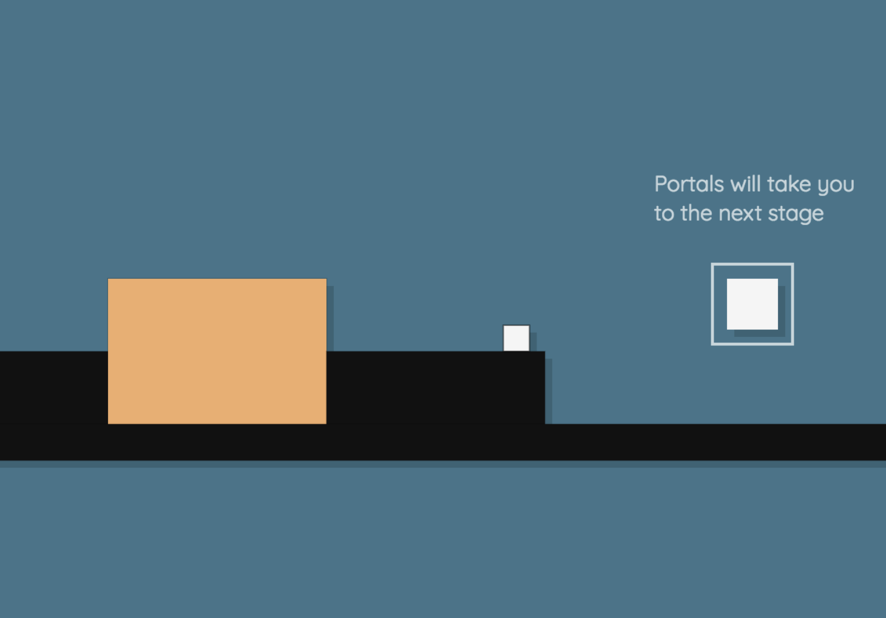

# ryb

This is ryb. A clone of a pretty neat indie game called Haiki. ryb was made using HTML5 canvas and good ol' JavaScript.

## Gameplay

ryb is a puzzle platformer where you try to traverse levels of increasing difficulty as a small square. The main mechanic of the game is that you have the ability to change the color of the background, which allows you to pass through objects of the same color. Using this power, you will be tasked with completing many interesting and challenging puzzles.

## Look and Feel

The color palette was choosen to closely resemble the Haiki, the game that inspired this project. The overall look was then designed to give a very minimalist and friendly appearance with the subtle shadowing and use of only simple geometric shapes.

The physics were based on the physics of platformers such as Super Mario Bros. and Super Meat Boy. Things like the acceleration of the character, wall jumping, and the camera movements were designed to give a very fluid and natural feel to the gameplay.

## Future Plans

More levels.
